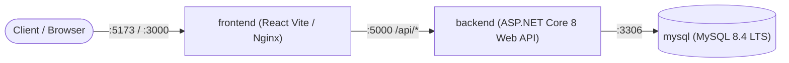

# 🐳 Panduan Docker & Setup Lingkungan Pengembangan
## Work Tracker Pro (TrackerKerja) v3.6

Dokumen ini menjelaskan konfigurasi Docker Compose, spesifikasi multi-container, variabel lingkungan (*environment variables*), port binding, serta tata cara menjalankan aplikasi pada mode pengembangan (*local development*) maupun produksi container.

---

### 1. Spesifikasi Multi-Container Docker Compose

Sistem terdiri dari 3 service utama yang diatur dalam satu berkas `docker-compose.yml`:



| Service Name | Base Image | Port Eksternal : Internal | Volume Persistence | Keterangan |
| :--- | :--- | :--- | :--- | :--- |
| **`mysql`** | `mysql:8.4` | `3306:3306` | `./mysql_data:/var/lib/mysql` | Database server dengan healthcheck `mysqladmin ping` |
| **`backend`** | Multi-stage .NET 8 | `5000:5000` | `./uploads:/app/uploads` | Web API RESTful, auto-migration, file storage |
| **`frontend`** | Node.js / Nginx Alpine | `5173:5173` (dev) / `3000:80` (prod) | - | Single Page Application (React 18 + Tailwind) |

---

### 2. Berkas `docker-compose.yml`

```yaml
version: '3.8'

services:
  mysql:
    image: mysql:8.4
    container_name: worktracker_mysql
    restart: unless-stopped
    environment:
      MYSQL_ROOT_PASSWORD: RootPassword2026!
      MYSQL_DATABASE: worktracker_db
      MYSQL_USER: tracker_user
      MYSQL_PASSWORD: TrackerPassword2026!
    ports:
      - "3306:3306"
    volumes:
      - ./mysql_data:/var/lib/mysql
    command: --default-authentication-plugin=mysql_native_password --character-set-server=utf8mb4 --collation-server=utf8mb4_unicode_ci
    healthcheck:
      test: ["CMD", "mysqladmin", "ping", "-h", "localhost", "-u", "root", "-pRootPassword2026!"]
      interval: 10s
      timeout: 5s
      retries: 5

  backend:
    build:
      context: ./backend
      dockerfile: WorkTracker.Api/Dockerfile
    container_name: worktracker_backend
    restart: unless-stopped
    depends_on:
      mysql:
        condition: service_healthy
    ports:
      - "5000:5000"
    environment:
      - ASPNETCORE_ENVIRONMENT=Production
      - ASPNETCORE_URLS=http://+:5000
      - ConnectionStrings__DefaultConnection=Server=mysql;Port=3306;Database=worktracker_db;User=tracker_user;Password=TrackerPassword2026!;CharSet=utf8mb4;
      - Jwt__Key=WorkTrackerPro_SuperSecretKey_Production_2026_Minimum256BitsKey!
      - Jwt__Issuer=WorkTrackerPro
      - Jwt__Audience=WorkTrackerProClient
      - Jwt__ExpirationMinutes=1440
      - Cors__AllowedOrigins=http://localhost:5173,http://localhost:3000
    volumes:
      - ./uploads:/app/uploads

  frontend:
    build:
      context: ./frontend
      dockerfile: Dockerfile
    container_name: worktracker_frontend
    restart: unless-stopped
    depends_on:
      - backend
    ports:
      - "3000:80"
```

---

### 3. Panduan Menjalankan Sistem

#### Opsi A: Menjalankan Seluruh Sistem dengan Docker Compose (Full Stack)
```powershell
# 1. Pastikan Docker Desktop sedang aktif
docker ps

# 2. Bangun dan jalankan seluruh container di background
docker compose up -d --build

# 3. Pantau status container
docker compose ps

# 4. Akses Aplikasi:
# Frontend Web App : http://localhost:3000
# Backend Swagger API : http://localhost:5000/swagger
```

#### Opsi B: Mode Pengembangan Hybrid (MySQL via Docker, Backend & Frontend Lokal)
Sangat direkomendasikan untuk pengembangan aktif sehari-hari:

##### 1. Jalankan Hanya Container MySQL:
```powershell
# Jalankan container MySQL saja
docker compose up -d mysql
```

##### 2. Jalankan Backend Web API (.NET 8):
```powershell
cd backend/WorkTracker.Api
# Update connection string di appsettings.Development.json mengarah ke localhost:3306
dotnet run --urls=http://localhost:5000
```
Swagger UI aktif di: `http://localhost:5000/swagger`

##### 3. Jalankan Frontend React SPA (Vite):
```powershell
cd frontend
npm.cmd install
npm.cmd run dev
```
React SPA aktif di: `http://localhost:5173` (otomatis mem-proxy panggilan `/api/*` ke `http://localhost:5000`).

---

### 4. Akun Default Bawaan Sistem (Seeder)
- **Email**: `admin@trackerkerja.com`
- **Password**: `Admin@123!`
- **Role**: `Admin`
- **Organisasi**: `PT Elistec Teknologi`
- **Status Akun**: Disetujui Otomatis (`IsApproved = true`)
